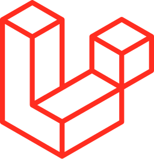
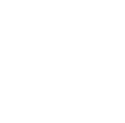
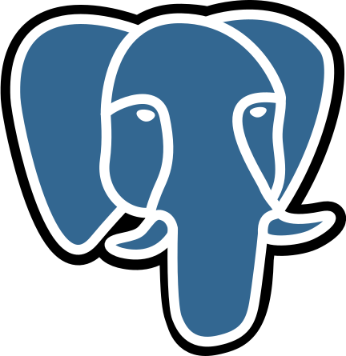
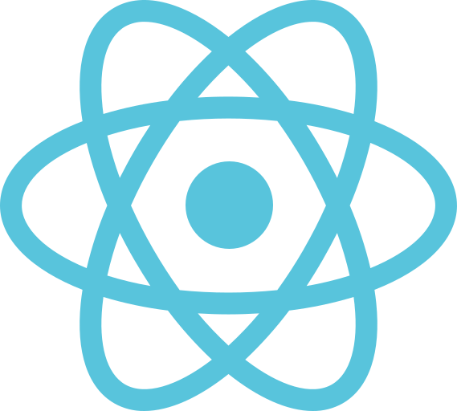
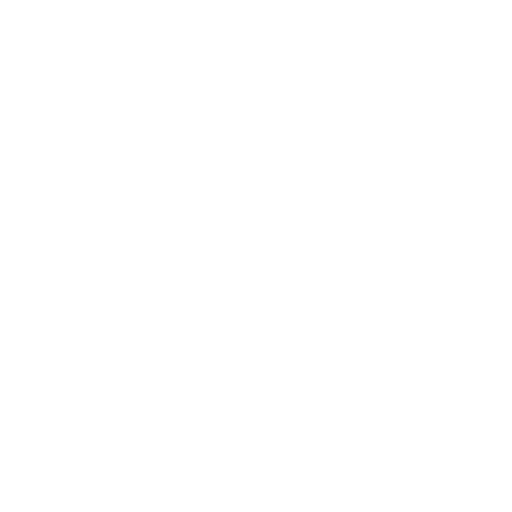

<!-- Animated GitHub Profile README - jayead1999 -->

<div align="center">



<br />
<br />


[](https://github.com/jayead1999)
[](https://github.com/jayead1999)


</div>

---

```bash
$ whoami
> Laravel Developer | Backend Engineer | Bangladesh
> Focus: PHP | Laravel | MySQL | PostgreSQL | Docker | Linux
> Learning: React.js
> Building: scalable APIs, server infrastructure, and full-stack products
```

<table>
  <tr>
    <td align="center" width="33%">
      <strong>3+ Years</strong><br />
      <sub>backend &amp; web experience</sub>
    </td>
    <td align="center" width="33%">
      <strong>12+ Tools</strong><br />
      <sub>Laravel, databases, DevOps</sub>
    </td>
    <td align="center" width="33%">
      <strong>100+ / Month</strong><br />
      <sub>shipping mindset</sub>
    </td>
  </tr>
</table>

---

## Core Stack

<table>
  <tr>
    <td align="center" width="120">
      <br />
      <strong>Laravel</strong><br />
      <sub>primary</sub>
    </td>
    <td align="center" width="120">
      <br />
      <strong>MySQL</strong><br />
      <sub>database</sub>
    </td>
    <td align="center" width="120">
      <br />
      <strong>PostgreSQL</strong><br />
      <sub>database</sub>
    </td>
    <td align="center" width="120">
      <br />
      <strong>Docker</strong><br />
      <sub>containers</sub>
    </td>
    <td align="center" width="120">
      <br />
      <strong>Linux</strong><br />
      <sub>servers</sub>
    </td>
  </tr>
</table>

## Growing Stack

<table>
  <tr>
    <td align="center" width="120">
      <br />
      <strong>React.js</strong><br />
      <sub>learning</sub>
    </td>
    <td align="center" width="120">
      <br />
      <strong>Next.js</strong><br />
      <sub>next up</sub>
    </td>
    <td align="center" width="120">
      <br />
      <strong>Node.js</strong><br />
      <sub>runtime</sub>
    </td>
    <td align="center" width="120">
      <br />
      <strong>MongoDB</strong><br />
      <sub>NoSQL</sub>
    </td>
    <td align="center" width="120">
      <br />
      <strong>Figma</strong><br />
      <sub>UI planning</sub>
    </td>
  </tr>
</table>

## Deployment & Workflow

<table>
  <tr>
    <td align="center" width="120">
      <br />
      <strong>GitHub</strong><br />
      <sub>version control</sub>
    </td>
    <td align="center" width="120">
      <br />
      <strong>Actions</strong><br />
      <sub>automation</sub>
    </td>
    <td align="center" width="120">
      <br />
      <strong>DigitalOcean</strong><br />
      <sub>cloud</sub>
    </td>
    <td align="center" width="120">
      <br />
      <strong>AWS</strong><br />
      <sub>cloud</sub>
    </td>
    <td align="center" width="120">
      <br />
      <strong>GCP</strong><br />
      <sub>cloud</sub>
    </td>
  </tr>
</table>

---

## Skill Proficiency

<table>
  <tr>
    <td><strong>Laravel / PHP</strong></td>
    <td><code>##################--</code></td>
    <td align="right"><strong>92%</strong></td>
  </tr>
  <tr>
    <td><strong>MySQL / PostgreSQL</strong></td>
    <td><code>#################---</code></td>
    <td align="right"><strong>85%</strong></td>
  </tr>
  <tr>
    <td><strong>Docker / Linux / Server</strong></td>
    <td><code>###############-----</code></td>
    <td align="right"><strong>78%</strong></td>
  </tr>
  <tr>
    <td><strong>JavaScript / HTML / CSS</strong></td>
    <td><code>##############------</code></td>
    <td align="right"><strong>70%</strong></td>
  </tr>
  <tr>
    <td><strong>React.js</strong></td>
    <td><code>########------------</code></td>
    <td align="right"><strong>40%</strong></td>
  </tr>
</table>

---

## GitHub Analytics

<div align="center">


<br />


<br />


</div>

---

## Build Direction

<table>
  <tr>
    <td align="center" width="25%">
      <br />
      <strong>API Craft</strong><br />
      <sub>Laravel services, REST APIs, auth flows</sub>
    </td>
    <td align="center" width="25%">
      <br />
      <strong>Data Layer</strong><br />
      <sub>queries, schema design, optimization</sub>
    </td>
    <td align="center" width="25%">
      <br />
      <strong>Shipping Flow</strong><br />
      <sub>Docker, CI/CD, deploy discipline</sub>
    </td>
    <td align="center" width="25%">
      <br />
      <strong>Full Stack</strong><br />
      <sub>React, components, product polish</sub>
    </td>
  </tr>
</table>

<table>
  <tr>
    <td width="33%">
      <strong>Now</strong><br />
      <sub>Building stronger Laravel APIs, cleaner service structure, and reliable database patterns.</sub>
    </td>
    <td width="33%">
      <strong>Next</strong><br />
      <sub>Deepening Docker, Linux server administration, GitHub Actions, and cloud deployment.</sub>
    </td>
    <td width="33%">
      <strong>Target</strong><br />
      <sub>Becoming a sharper full-stack engineer who can design, build, deploy, and maintain production-ready products.</sub>
    </td>
  </tr>
</table>

---

<details open>
<summary><b>Journey</b></summary>

| Year | Focus |
|---|---|
| 2025 - now | Expanding into React and modern frontend, Docker orchestration, and server infrastructure |
| 2023 - 2024 | Laravel APIs, backend architecture, authentication systems, database optimization, PostgreSQL |
| 2021 - 2022 | HTML, CSS, JavaScript, Java fundamentals, and PHP basics |

</details>

<details>
<summary><b>Language Breakdown</b></summary>

| Language | Usage |
|---|---:|
| PHP | 48% |
| Blade (Laravel) | 22% |
| JavaScript | 15% |
| SQL | 10% |
| Other | 5% |

</details>

<details>
<summary><b>Currently Building Toward</b></summary>

| Goal | Status |
|---|---|
| Laravel REST APIs at scale | Active |
| Docker containerization and CI/CD | Active |
| Linux server admin and hardening | Active |
| React.js frontend development | Next up |

</details>

---

## Connect

<div align="center">

<a href="https://github.com/jayead1999">
  
</a>

<br />
<br />


<br />
<br />

<sub>Always learning | Always shipping | jayead1999</sub>

</div>
